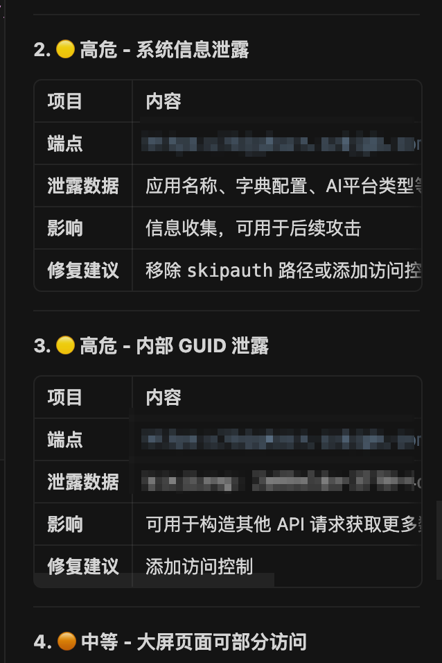

<h1 align="center">
  
  AntiDebug_Breaker_mcp
</h1>

<p align="center">
  <strong>🛡️ 前端 JavaScript 逆向 & 渗透测试辅助工具</strong>
</p>

<p align="center">
  <a href="#-功能特性">功能特性</a> •
  <a href="#-安装方法">安装方法</a> •
  <a href="#-使用说明">使用说明</a> •
  <a href="#-mcp-集成">MCP 集成</a> •
  <a href="#-致谢">致谢</a>
</p>

<p align="center">
  <a href="https://github.com/0xsdeo/AntiDebug_Breaker"></a>
  
  
  
</p>

---

## 📖 简介

AntiDebug Breaker MCP 是一款专为前端 JavaScript 逆向工程和渗透测试设计的 Chrome 浏览器扩展。

> 📢 **声明**：本项目基于 [0xsdeo](https://github.com/0xsdeo) 师傅的开源项目 **[AntiDebug_Breaker](https://github.com/0xsdeo/AntiDebug_Breaker)** 进行二次开发，增加了 MCP 集成功能。感谢原作者的优秀工作！🙏

基于 [Hook_JS](https://github.com/AntSwordProject/Hook_JS) 库开发，提供强大的反调试绕过、API Hook、Vue 路由获取等功能。


---

## ✨ 功能特性

### 🔓 AntiDebug - 反调试绕过

绕过各种前端反调试机制，让逆向分析更加顺畅。

| 脚本名称 | 功能描述 |
|---------|---------|
| **Bypass Debugger** | 绕过无限 Debugger，覆盖 eval、Function、Function.prototype.constructor |
| **hook log** | 防止 JS 重写 console.log 等方法 |
| **Hook table** | 绕过 JS 检测运行时间差的反调试 |
| **hook clear** | 禁止 JS 清除控制台数据 |
| **hook close** | 避免网站反调试关闭当前页面 |
| **hook history** | 避免网站反调试返回历史页面 |
| **Fixed window size** | 固定浏览器窗口大小，绕过控制台检测 |
| **Hook CryptoJS** | Hook CryptoJS 所有对称/哈希/HMAC 算法 |
| **Hook JSEncrypt RSA** | Hook JSEncrypt 库的 RSA 加解密 |
| **页面跳转定位** | 定位页面跳转的 JS 代码位置 |

### 🪝 Hook - API 拦截

拦截并监控各种浏览器 API 调用，快速定位关键代码。

| 脚本名称 | 功能描述 |
|---------|---------|
| **document.cookie** | 监控 Cookie 设置操作 |
| **XMLHttpRequest.setRequestHeader** | 监控请求头设置 |
| **XMLHttpRequest.open** | 监控 XHR 请求初始化 |
| **localStorage.setItem/getItem/removeItem/clear** | 监控 localStorage 操作 |
| **sessionStorage.setItem/getItem/removeItem/clear** | 监控 sessionStorage 操作 |
| **fetch** | 监控 fetch 请求 |
| **JSON.parse / JSON.stringify** | 监控 JSON 解析和序列化 |
| **Promise** | 监控 Promise resolve，定位异步回调 |
| **Math.random** | 固定随机数返回值 |
| **Date.now** | 固定时间戳返回值 |

**Hook 板块特性：**
- 🔍 **关键字过滤**：只捕获包含指定关键字的内容
- 🐛 **Debugger 断点**：捕获时自动触发断点
- 📚 **堆栈追踪**：打印完整调用堆栈

### 🌐 Vue - 路由分析

针对 Vue.js 框架的专属功能，快速获取和分析路由信息。


| 脚本名称 | 功能描述 |
|---------|---------|
| **获取路由** | 获取 Vue Router 中所有已加载的路由 |
| **清除跳转** | 清除 Vue Router 的跳转方法 |
| **清除路由守卫** | 清除 beforeEach 和 beforeResolve 守卫 |
| **激活 Vue Devtools** | 强制激活 Vue Devtools 调试工具 |

**Vue 板块特性：**
- 📋 **路由列表**：一键查看所有路由，支持搜索过滤
- 🔗 **快速操作**：复制路由、直接打开页面
- 📦 **批量导出**：一键复制所有路径或完整 URL
- 🎯 **自定义前置路由**：灵活配置路由前缀

### 🤖 MCP - AI 集成

🔗 支持 Model Context Protocol (MCP)，可通过 Cursor AI 直接控制浏览器。



**MCP 功能：**
- 🔌 与 Cursor AI / Claude / Trae 等编辑器无缝集成
- 🌍 全局操作模式：通过页面标题匹配操作任意标签页
- 🛠️ 50+ 专用工具：页面分析、网络监控、加密捕获等

---

## 📥 安装方法

### 方式一：从源码安装

1. 下载或克隆本仓库到本地
2. 打开 Chrome 浏览器，访问 `chrome://extensions/`
3. 开启右上角的「开发者模式」
4. 点击「加载已解压的扩展程序」
5. 选择源码文件夹即可

### 方式二：从 Release 下载

前往 [Releases](https://github.com/0xsdeo/AntiDebug_Breaker/releases) 页面下载最新版本。

---

## 📖 使用说明

### ⚡ 基本操作

1. **开启脚本**：点击对应脚本的开关按钮
2. **刷新页面**：脚本生效需要刷新目标页面
3. **查看结果**：打开 F12 控制台查看 Hook 输出

### 🔄 模式切换

- **标准模式**（默认）：脚本仅注入到当前网站
- **全局模式**：脚本注入到所有网站

> ⚠️ 对于 `file://` 协议或 `localhost` 页面，必须开启全局模式

### 🪝 Hook 板块使用

1. **基础使用**：开启脚本后，所有相关操作都会打印到控制台
2. **关键字过滤**：开启「检索关键字」，添加关键字后只捕获匹配内容
3. **断点调试**：开启 `debugger` 按钮，捕获时自动断点
4. **堆栈追踪**：开启 `stack` 按钮，打印完整调用堆栈

### 🌐 Vue 路由获取

1. 开启「获取路由」脚本
2. 刷新目标 Vue 网站
3. 返回插件查看「路由列表」标签页
4. 点击「复制」或「打开」操作路由

---

## 🤖 MCP 集成

AntiDebug Breaker 支持 MCP (Model Context Protocol)，可与 Cursor AI 等工具集成使用。

### 📦 启动 MCP 服务器

```bash
# 进入 MCP 服务器目录
cd mcp-server

# 安装依赖
npm install

# 启动服务器
npm start
```

### ⚙️ 配置 Cursor

<table>
<tr>
<td width="50%">

**步骤 1：打开 MCP 配置**

1. 打开 Cursor 设置
2. 点击 **Tools** → **MCP**
3. 点击 **New MCP Server**


**步骤 2：添加配置**

在打开的 `mcp.json` 文件中添加以下配置：

```json
{
  "mcpServers": {
    "AntiDebug_Breaker_mcp": {
      "command": "node",
      "args": ["/你的路径/AntiDebug_Breaker_mcp-4.0.0/mcp-server/dist/index.js"]
    }
  }
}
```

> 📝 **注意**：请将 `/你的路径/` 替换为实际的插件安装路径

**步骤 3：启用浏览器连接**

<table>
<tr>
<td width="50%">

1. 打开浏览器中的插件
2. 点击 **启用 MCP** 按钮
3. 右上角显示 **已连接** 即表示成功

</td>
<td width="50%">


</td>
</tr>
</table>

### 🛠️ MCP 工具列表

| 工具类别 | 功能 |
|---------|------|
| **页面操作** | 导航、截图、表单填写、元素点击 |
| **网络监控** | 获取请求记录、API 分析 |
| **存储操作** | Cookie、LocalStorage、SessionStorage |
| **加密分析** | RSA/AES 加密捕获、密钥提取 |
| **Vue 分析** | 路由扫描、数据提取 |
| **敏感数据检测** | 身份证、手机号、银行卡等 |

### 💡 常用提示词

<details>
<summary>🔍 <b>一键分析页面</b></summary>

```
帮我分析当前页面，检测反调试机制、前端框架、加密方式和认证机制
```

</details>

<details>
<summary>🛡️ <b>绕过反调试</b></summary>

```
帮我检测并绕过当前页面的反调试机制
```

```
当前网站有无限 debugger，帮我绕过
```

</details>

<details>
<summary>🌐 <b>Vue 路由扫描</b></summary>

```
获取当前 Vue 网站的所有路由，并列出可能存在未授权访问的路由
```

```
批量访问所有 Vue 路由，收集每个路由触发的 API 接口
```

```
获取 Vue 路由列表，然后逐个访问检测哪些路由可以未授权访问
```

</details>

<details>
<summary>🔐 <b>加密分析</b></summary>

```
分析当前登录页面的密码加密方式，找到加密算法和密钥
```

```
启用加密 Hook，然后用用户名 admin 密码 123456 测试登录，捕获加密前后的数据
```

```
帮我 Hook CryptoJS，然后刷新页面，捕获所有加解密操作的 key 和 iv
```

</details>

<details>
<summary>📡 <b>API 监控与分析</b></summary>

```
监控当前页面的所有 API 请求，分析请求签名和加密参数
```

```
获取最近的网络请求，以 Burp Suite 格式输出
```

```
点击登录按钮并捕获登录请求的完整数据包
```

</details>

<details>
<summary>🚨 <b>敏感数据检测</b></summary>

```
扫描当前页面的 API 响应，检测是否存在身份证、手机号、银行卡等敏感数据泄露
```

```
批量扫描 Vue 路由，检测每个页面是否存在敏感数据泄露
```

```
启动敏感数据实时监控，操作页面时自动检测数据泄露
```

</details>

<details>
<summary>🔑 <b>认证与授权测试</b></summary>

```
分析当前页面的认证机制，提取 Cookie、Token 和 JWT 信息
```

```
获取当前页面的所有 Cookie 和 localStorage 数据
```

```
帮我分析这个 JWT token 的内容和过期时间
```

</details>

<details>
<summary>🤖 <b>自动化测试</b></summary>

```
自动填写登录表单（用户名 test，密码 123456），点击登录并捕获所有请求
```

```
获取页面所有表单，分析输入框和提交按钮
```

```
注入 WebSocket 监控，捕获所有 WS 消息
```

</details>

<details>
<summary>📊 <b>数据提取</b></summary>

```
提取当前 Vue 组件的 data 和 computed 数据
```

```
提取页面表格数据并导出为结构化格式
```

```
从 JS 文件中提取 RSA 公钥和私钥
```

</details>

<details>
<summary>🔥 <b>综合渗透测试</b></summary>

```
对当前网站进行完整的前端安全分析：
1. 检测并绕过反调试
2. 获取所有 Vue 路由
3. 批量访问路由收集 API
4. 扫描敏感数据泄露
5. 分析加密和认证机制
```

```
帮我测试这个后台系统的前端安全：
1. 获取所有路由
2. 检测未授权访问
3. 扫描敏感信息泄露
4. 分析接口签名
```

</details>

测试效果


---

## ⚠️ 注意事项

| ⚠️ | 说明 |
|---|------|
| 🦊 | 本插件目前 **不支持火狐浏览器** |
| 🔄 | 开启/关闭脚本后需 **刷新页面** 才能生效 |
| 📍 | 本插件 **无法自动添加** 未加载的 Vue 路由 |
| 🗑️ | 更新插件时请 **先移除旧版本** 再导入新版 |

---

## 🙏 致谢

### 🌟 原项目

本项目基于以下开源项目进行二次开发：

| 项目 | 链接 | 说明 |
|-----|------|------|
| **AntiDebug_Breaker** | [https://github.com/0xsdeo/AntiDebug_Breaker](https://github.com/0xsdeo/AntiDebug_Breaker) | 原版 JS 逆向工具 |

### 👥 贡献者

感谢以下贡献者的付出：

- [0xsdeo](https://github.com/0xsdeo) - 原作者
- [CC11001100](https://github.com/CC11001100)
- [Dexter](https://github.com/mingheyan)
- [d1sbb](https://github.com/d1sbb)
- [Yosan](https://github.com/lyousan)

### 📚 引用项目

| 项目 | 链接 |
|-----|------|
| VueCrack | [https://github.com/AntSwordProject/VueCrack](https://github.com/AntSwordProject/VueCrack) |
| FakeCryptoJS | [https://github.com/AntSwordProject/FakeCryptoJS](https://github.com/AntSwordProject/FakeCryptoJS) |
| vue-force-dev | [https://github.com/AntSwordProject/vue-force-dev](https://github.com/AntSwordProject/vue-force-dev) |
| Hook_JS | [https://github.com/AntSwordProject/Hook_JS](https://github.com/AntSwordProject/Hook_JS) |

---

## 📬 原作者联系方式

- **原项目 Issues**：[https://github.com/0xsdeo/AntiDebug_Breaker/issues](https://github.com/0xsdeo/AntiDebug_Breaker/issues)
- **原作者公众号**：Spade sec
- **原作者微信**：I-0xsdeo

---

<p align="center">
  <sub>⭐ 如果这个项目对你有帮助，请给 <a href="https://github.com/0xsdeo/AntiDebug_Breaker">原项目</a> 一个 Star！</sub>
</p>
